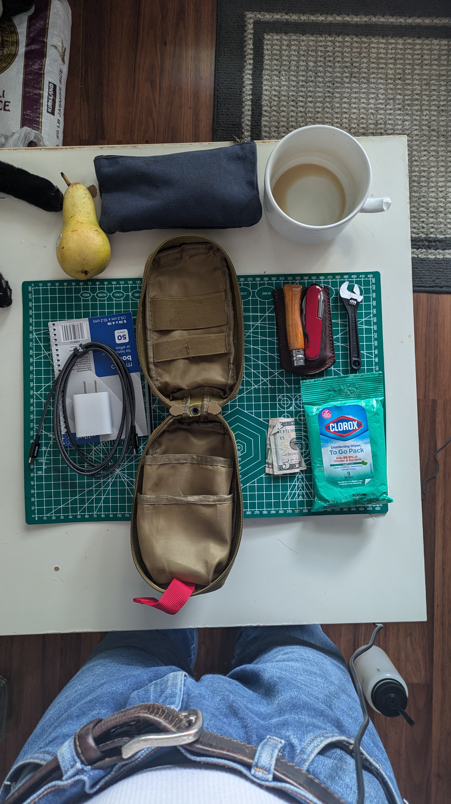
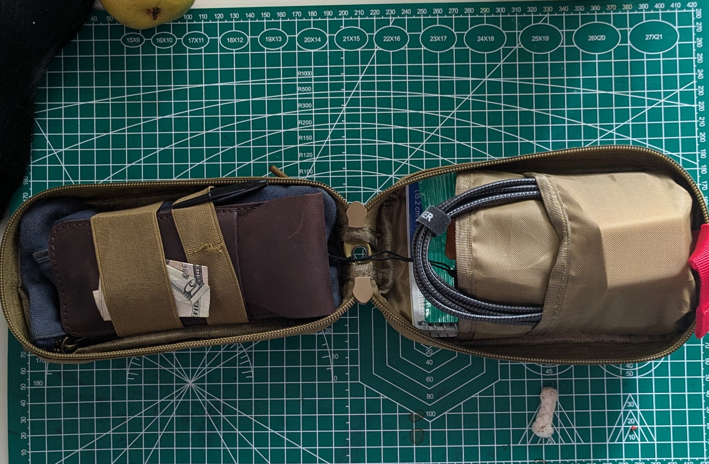

+++
title =  "Curate an EDC Pouch"
date = "2024-06-17 15:42:34.376 -0500" 
description = "Organizing your random tools into an edc pouch"
author = "Justin Napolitano"
tags = ['cooking']
images = ["images/feauture-pouch.jpg"]
+++

## Why

i have a bunch of random tools and pouches laying about. I don't like it. So to feel better i want to organize a pouch that i can throw into any of my bags so that i can deal with most things i face in day to day to life.

## Guiding principles

* I want tools that reduce the friction in my average day to day dealings
* I want the pouch to be small enough to fit inside all of my bags
* I want the tool set to be modular so that it can be used as the base of other kits. 

## Audit your supplies

in my case I have at my disposal. I'd love to buy mores stuff, but if I am being honest with myself.. i think that i can take care of most of my needs with the things below. I will test it out and see if any new needs arise.

### Supply list

1. A pouch.
2. Swiss army knife.
3. 4 inch crescent wrench.
4. Some clorox wipes.
5. A bit of cash.
6. A note pad.
7. A pen.
8. Cell phone charging block.
9. USB C cable.
10. A first aid kit
11. Opinel no 7 Carbon Knife
12. Some latex gloves
    

### Determine every day uses

in order to carry this stuff around with me in my bag I have to justify the weiht and the space.  

#### Justify the Pouch

the pouch is just some nylon pouch i used in the past for a trauma kit. I dismantled that because i do not really have enough experience to justify patching up some seriously injured person... nor myself.  It is a pretty good size. It is small enough to fit in my sling bag and into my haversack.

#### Justify the Swissie

the swiss army tinker is a great little tool. I use it pretty often to help me get out of binds and to reduce friction in my daily life.  

It has...

1. Main knife.
2. A backup knife.
3. A can opener.
4. A bottle opener.
5. A phillips head.
6. a flat head.
7. An awl.
8. A reamer. 
9. A pry bar.
10. A tooth pick.
11. A pin.
12. Tweezers.

#### Justify the crescent wrench

the crescent is the only item that i purchased in this set. If I am being completely honest with myself i have yet to use it. I can foresee it being useful if i have to loosen a bolt or hold a locking nut.  That said, i do not know if it will prove to as useful as i would like it to be. The 4 inch is also really small. i wonder if i should have gone with the 6 inch. 

#### Justify the clorox wipes

i use the clorox wipes to clean off my tools and my utensils after use. i also find that many restaurants and public toilets are too dirty for me to comfortably use. the wipes are useful to me in thoe cases. 

#### Justify the cash

a few dollars takes up no space and is useful in a bind. If it is easy to access i will use it. if it is not put away i will lose it.  Sometimes i forget my wallet or card at home. it is justified. 

#### Justify the notepad

being able to write something down to later add to note keeping application is really useful to me. Also, i like to brainstorm on paper and store digitally.  the advantage of this to me is that i can keep my digital life more organized and just throw away the fragile paper.  

#### The pen

this is justified. done. 

### Charging block and usb c

i try to only buy usb c electronics. Thankfully this is getting easier to do.  The charging block justifies itself. So does the cable that accompanies it. 

#### Justify the first aid and hygiene kit

this is just a basic first aid kit to cover my bases. it is not meant to be a trauma kit... nor is it expected to be all encompasing.  every day needs require something that will help me to treat minor scrapes.

i think i could expand upon the hygiene kit. a toothbrush, hydrogen peroxide, tooth paste, and small cut of face soap might be good solutions to include. i'll write another post where i expand upon this.  

the first aid/hygiene contains

1. band-aids.
2. some gauze.
3. a tick remover.
4. a nail file.
5. nail clippers

#### Justify the opinel

i like the opinel no 7. I think at the end of the day everything comes down to whether or not i want and like it... now trying to justify my liking it.. the opinel no 7 has a slightly larger blade than the main blade of the swissie tinker.  The opinel is also not threatening at all. I can use it cut an apple or eat at a restaurant without raising any eyebrows. it is also sharp enough to be capable of most "survival" tasks that i can throw at it if the occasion arises. 

> the carbon steel seems like a good idea initially. it is cool, but it rusts in the houston moisture. the next one i buy will definitely be stainless. Unfortunately this knife will last me the rest of my life.

#### Justify the latex gloves

I do not like making my hands dirty.  Nor do i like touching unsanitized things.  if either of those things could happen i pull on the gloves. 

## Put it all together

you know there really isn't much to this one. Just put everything in the pouch in a way that is organized and not messy. 

